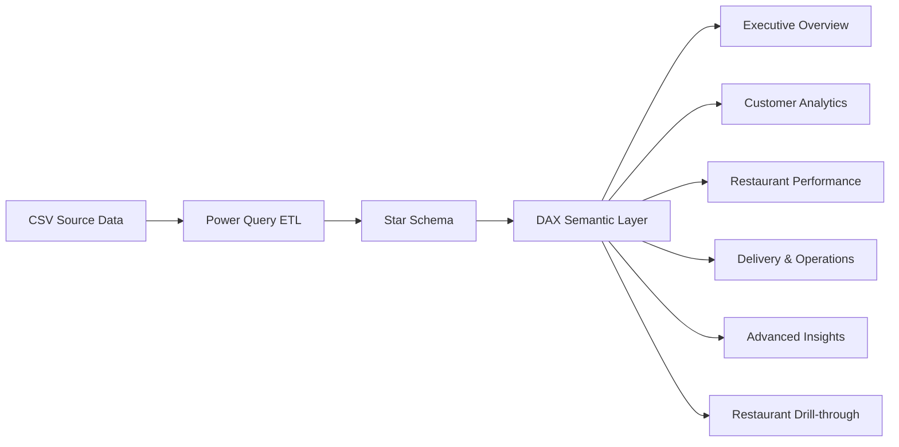
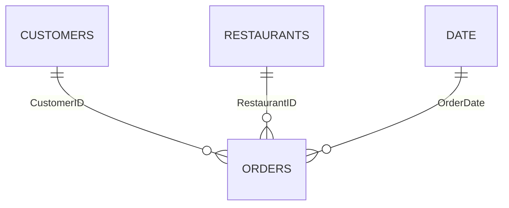

# 🍽️ Food Delivery Business Analytics — Power BI

A portfolio-ready, end-to-end **Business Intelligence** project that transforms food-delivery transaction data into executive, customer, restaurant, and delivery-performance insights using **Power BI, Power Query, DAX, and star-schema modeling**.

> **Portfolio data disclosure:** The dataset in this repository is synthetic and was generated specifically for learning/portfolio use. It does not represent real Zomato, Swiggy, customer, or restaurant data.

## Project Scale

| Metric | Value |
|---|---:|
| Orders | **200,000** |
| Customers | **20,000** |
| Restaurant registries | **56,000** |
| Generated Revenue | **₹164.91M** |
| Average Order Value | **₹824.57** |
| Cities | **8** |
| Cuisine Categories | **12** |
| DAX Measures | **21** |
| Model Tables | **4** |
| Dashboard Pages | **6** |
| Repeat Customer Rate | **50.28%** |
| Late Order Rate | **48.12%** |
| Avg Delivery Time | **44.55 min** |

> The full CSV dataset is generated locally with `scripts/generate_data.py` so the GitHub repository stays lightweight and reproducible.

## Business Questions

- Which cities, areas, restaurants and cuisines drive the most revenue?
- How strong is customer retention?
- Which customer segments contribute the most value?
- Where are cancellation and late-delivery rates highest?
- How does revenue change by month, quarter and year?
- Do premium restaurants generate more revenue per order?
- Which restaurants combine high revenue with strong ratings?

## Architecture



## Data Model



- **Fact:** Orders
- **Dimensions:** Customers, Restaurants, Date
- **Relationships:** 1:* single-direction dimension-to-fact

## 21 DAX Measures

**KPI:** Total Revenue, Total Orders, Average Order Value, Avg Delivery Time, Total Customers, Total Restaurants  
**Delivery:** Delivered Orders, Cancelled Orders, Cancel %, Late Orders, Late Delivery %  
**Customer:** Repeat Customers, Repeat Customer %, Orders per Customer  
**Restaurant:** Revenue per Restaurant, Average Rating, Average Votes  
**Time Intelligence:** Revenue YTD, Orders YTD, Revenue Previous Month, Revenue Growth %

See [`powerbi/dax_measures.dax`](powerbi/dax_measures.dax).

## Dashboard Pages

1. **Executive Overview** — revenue, orders, AOV, customers, delivery time, city/area trends and top restaurants
2. **Customer Analytics** — repeat customers, segments, cohorts, geography and high-value customers
3. **Restaurant Performance** — ratings, cuisines, cost buckets, revenue and top-performing restaurants
4. **Delivery & Operations** — delivery time, late orders, cancellations, distance and city-level operations
5. **Advanced Insights** — field parameters, decomposition tree, Q&A, drill-down and tooltips
6. **Restaurant Details** — drill-through page for restaurant-specific KPIs and trends

Detailed build instructions: [`powerbi/BUILD_GUIDE.md`](powerbi/BUILD_GUIDE.md).

## Key Insights from the Generated Dataset

- **50.28% repeat-customer rate**
- **48.12% late-order rate**
- **10.00% cancellation rate**
- **59.10% of orders in the Budget segment**
- **Bengaluru** is the highest-revenue city
- **North Indian** is the highest-volume cuisine
- **Kolkata** has the highest late-delivery rate

See [`docs/insights.md`](docs/insights.md).

## Repository Structure

```text
food-delivery-powerbi-analytics/
├── data/
│   └── README.md  # generated CSVs live here locally
├── powerbi/
│   ├── BUILD_GUIDE.md
│   ├── dax_measures.dax
│   ├── power_query_orders.m
│   ├── power_query_customers.m
│   ├── power_query_restaurants.m
│   ├── power_query_date.m
│   └── theme.json
├── docs/
│   ├── data_dictionary.md
│   ├── data_model.md
│   ├── insights.md
│   ├── resume_bullets.md
│   └── SOURCE_NOTES.md
├── validation/
│   └── metrics_summary.json
├── scripts/
│   └── generate_data.py
├── .gitignore
├── LICENSE
└── README.md
```

## Build the Power BI Report

1. Clone/download this repository.
2. Run `pip install -r requirements.txt` and then `python scripts/generate_data.py` to generate the full synthetic dataset locally.
3. Open Power BI Desktop.
4. Create a text parameter named `DataFolder` pointing to the generated `/data` folder.
5. Paste the four M queries from `/powerbi`.
6. Create the 3 relationships defined in `/docs/data_model.md`.
7. Add the 21 DAX measures.
8. Apply `/powerbi/theme.json`.
9. Build the six pages using `/powerbi/BUILD_GUIDE.md`.
10. Save the finished file as `FoodDeliveryAnalytics.pbix` in the repository root.

## Resume Description

> Engineered an end-to-end Power BI analytics solution across **200K+ orders, 20K customers and 56K restaurants generating ₹164.9M revenue**, building a **4-table star schema and 21 DAX measures**; designed **6 interactive dashboards** surfacing customer retention, restaurant performance, cancellation and delivery-latency insights.

## Inspiration

The project structure was inspired by the educational workflow in Sheryians AI School's Power BI food-delivery analytics tutorial:

https://www.youtube.com/watch?v=xj-ByfvYtuQ

This repository is an original portfolio implementation and uses independently generated fictional data.
