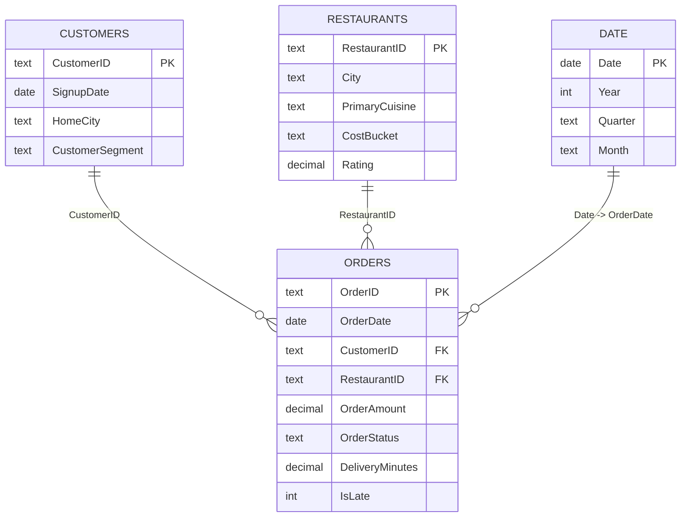

# Data Model

Use a star schema with single-direction relationships from dimensions to the fact table.

## Relationships
1. `Customers[CustomerID]` (1) → `Orders[CustomerID]` (*)
2. `Restaurants[RestaurantID]` (1) → `Orders[RestaurantID]` (*)
3. `Date[Date]` (1) → `Orders[OrderDate]` (*)

Set all three relationships to **Single** cross-filter direction.
Mark `Date` as the model's date table using `Date[Date]`.
